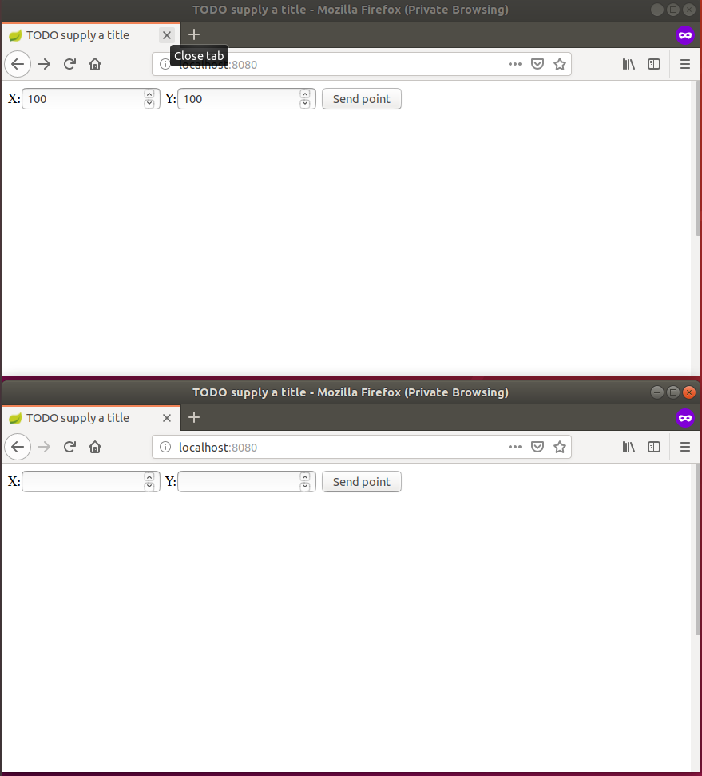
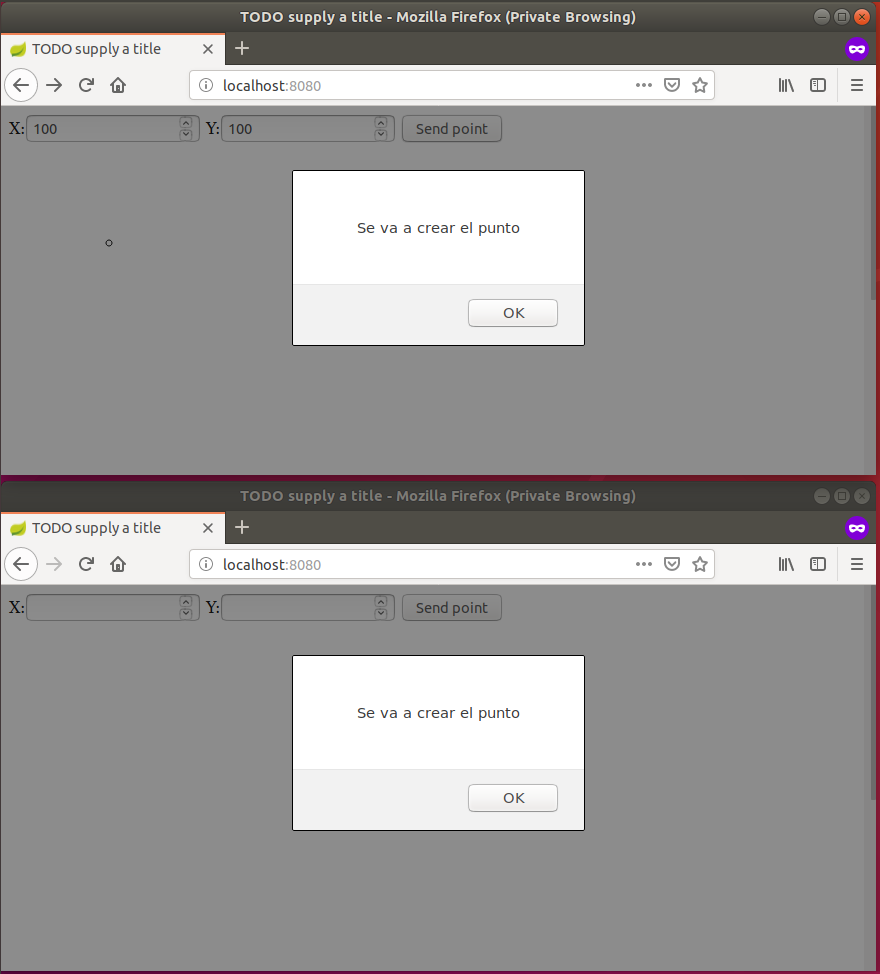
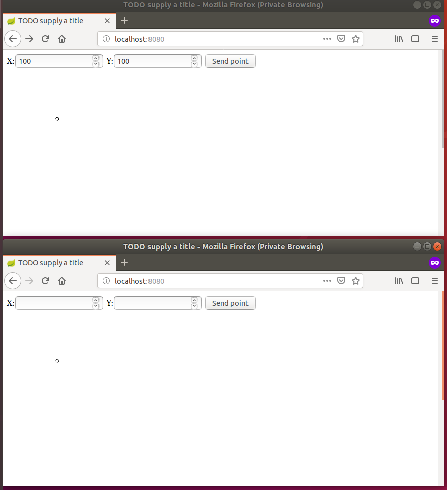

# stompWebsockets

# PARTE 1	
Para las partes I y II, usted va a implementar una herramienta de dibujo colaborativo Web, basada en el diagrama de actividade Para esto, realice lo siguiente:

1. Haga que la aplicación HTML5/JS al ingresarle en los campos de X y Y, además de graficarlos, los publique en el tópico: /topic/newpoint . Para esto tenga en cuenta (1) usar el cliente STOMP creado en el módulo de JavaScript y (2) enviar la representación textual del objeto JSON (usar JSON.stringify). Por ejemplo:
	
//creando un objeto literal "stompClient.send("/topic/newpoint", {}, JSON.stringify({x:10,y:10}));"

//enviando un objeto creado a partir de una clase "stompClient.send("/topic/newpoint", {}, JSON.stringify(pt));"

2. Dentro del módulo JavaScript modifique la función de conexión/suscripción al WebSocket, para que la aplicación se suscriba al tópico "/topic/newpoint" (en lugar del tópico /TOPICOXX). Asocie como 'callback' de este suscriptor una función que muestre en un mensaje de alerta (alert()) el evento recibido. Como se sabe que en el tópico indicado se publicarán sólo puntos, extraiga el contenido enviado con el evento (objeto JavaScript en versión de texto), conviértalo en objeto JSON, y extraiga de éste sus propiedades (coordenadas X y Y). Para extraer el contenido del evento use la propiedad 'body' del mismo, y para convertirlo en objeto, use JSON.parse. Por ejemplo " var theObject=JSON.parse(message.body); "

3. Compile y ejecute su aplicación. Abra la aplicación en varias pestañas diferentes (para evitar problemas con el caché del navegador, use el modo 'incógnito' en cada prueba).

4. Ingrese los datos, ejecute la acción del botón, y verifique que en todas la pestañas se haya lanzado la alerta con los datos ingresados.

5. Haga commit de lo realizado, para demarcar el avance de la parte 2 "git commit -m "PARTE 1"."

create by karen mora
